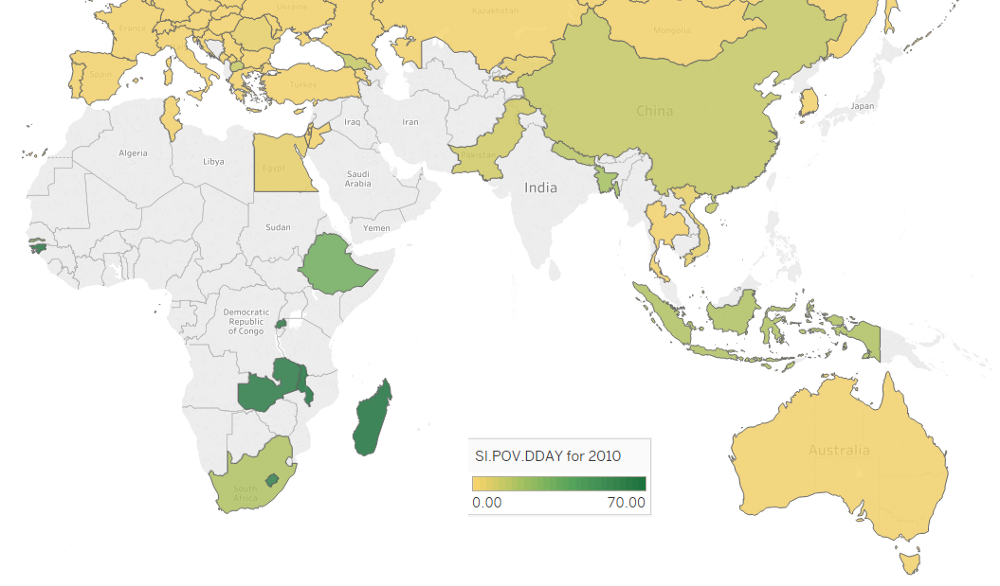

# sustainable-dev-goals-forecasting
Time-series forecasting using machine learning methods. 

In 2014 the UN called for a data revolution to put the best available tools and methods to work in service of achieving the Sustainable Development Goals (SDGs). Here, we attempt to use machine learning to forecast one of the indicators for SDG 1, it's objective being to "end poverty in all it's forms everywhere".

Blog post with details and walkthrough of the code can be found [here](https://medium.com/@fergus.oboyle/can-machine-learning-be-used-to-forecast-poverty-c7a54bbd6e6c)

In this project, we will try to forecast the WDI "Poverty headcount ratio at $1.90 a day (2011 PPP) (% of population)". This is one of the principal indicators used to measure progress towards meeting the first Sustainable Development Goal. We will forecast the indicator for the year 2010 and use data up to and including the year 2009 from all indicators (including the target indicator) using machine learning techniques. By choosing a target year (i.e. 2010) for which we have data, allows us to measure our predictions against the actual reported values and measure the success (or failure) of our algorithms. Unfortunately, due to a lot of missing data in the WDI dataset, we only have a recorded measurement for the target WDI in 2010 for a subset of countries. This will be discussed more in the blog. The missing data can be seen in the following map:

## Packages

The code can be run from a set of Jupyter notebooks (in the notebooks directory) with support from some python ultily files (in the utils directory). Installing Anaconda and running jupyter from it is the easiest way to go (see below).

The required packages are specified in the environment.yml file. The environment and all required packages can be reconstructed in an anaconda environment by following the instructions in the Execution section. 

## Files

* README.md: This file    
* notebooks/clean_input_streams.ipynb: Data Preparation before modelling   
* notebooks/linear_regression_predictor.ipynb: Linear Models   
* notebooks/naive_predictor.ipynb: Naive Prediction Model  
* notebooks/data_gathering/data_collection.ipynb: World Bank API interface   
* notebooks/data_gathering/world_bank_bulk_csv.ipynb: Reading from World Bank csv file   
* utils/evaluate.py : utilities for evaluating models  
* utils/missing.py: utilities related to missing values  
* utils/preprocess.py: utiltiies for preprocessing of data before modelling   
* environment.yml: List of required packages for setting up of Anaconda environment  
* LICENSE: License file   

## Installation and execution

### Checkout code from Github

1. Follow [these](https://help.github.com/en/articles/cloning-a-repository) instructions for cloning this repo to a location on your computer.

### Installing Anaconda

1. Download Anaconda from [here](https://www.anaconda.com/distribution/).
2. Install Anaconda using [these](https://docs.anaconda.com/anaconda/install/) instructions.
3. Open the Anaconda shell.
3. Within the Anaconda shell, change directory to the root directory of the local sustainable-dev-goals-forecasting repo.
4. Create a new environment in the Anaconda Shell: >conda env create -n my_new_env --file environment.yml.
5. Switch to the new environment: >conda activate my_new_env.

### Running Jupyter Notebook

1. In the Anaconda shell, if you are not already in the root directory of the local sustainable-dev-goals-forecasting repo, change directory to there now.
2. Launch Jupyter Notebook from the Anaconda shell (>jupyter notebook). The Jupyter Notebook app will open up in a web browser. 

### Reading data,preprocessing, and execution of the predictive models

1. Follow the instructions in the next section to download the World Development Indicator data.
2. Run world_bank_bulk_csv.ipynb to read data from the WDIData.csv. world_bank_bulk_data.pkl is created in data/.
3. Run clean_input_streams.ipynb to clean data. cleaned_data.pkl is created.
4. Run model files: naive_predictor.ipynb or linear_regression_predictor.ipynb.

## Access to data from the World Bank

1. Data can be accessed at the World Bank [Data Catalog](https://datacatalog.worldbank.org/dataset/world-development-indicators).
2. Click on the "Data & Resources" tab.
3. Download data in CSV format.
4. Extract files from the donloaded folder.
5. Place WDIData.csv into a data/ subfolder of your local repo.

## Todo

* Try Random forest model  
* Try XGBoost  
* Add more historical values of the target  
* Add historical values of the target residual  as a new feature  
* Try more advanced methods of imputation using mtsdi package in R  
* Try Feature reduction using Foreward selection algorithm    
* Try some classical time-series forecasting algorithms  

